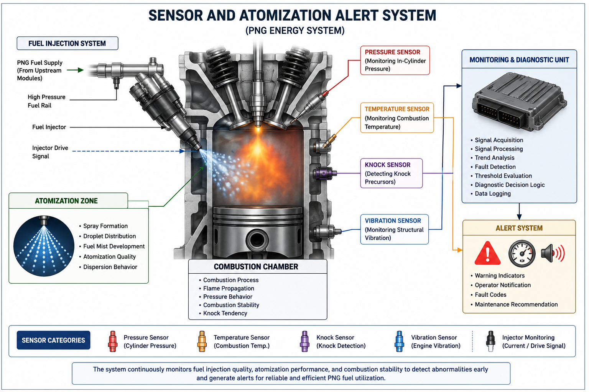

# Sensor and Atomization Alert System

## 5.0 Overview
The Sensor and Atomization Alert System is a real-time monitoring and diagnostic layer within the PNG (Pure Natural Gas) Energy System. This module is responsible for monitoring fuel injection quality, atomization performance, combustion stability, and early-stage operational abnormalities during PNG fuel utilization.

The module operates downstream of the PNG fuel production stage and supports engine-level performance evaluation through continuous system observation, sensor feedback interpretation, and diagnostic trend analysis.

---

## 5.1 System Objective
The primary objective of this module is to improve operational reliability, combustion stability, and fuel utilization efficiency through real-time sensing and diagnostic analysis.

The system focuses on:
- Injection quality monitoring  
- Fuel atomization assessment  
- Combustion instability detection  
- Early fault identification  
- Performance trend observation  
- Diagnostic response support  
- Operational safety enhancement  

---

## 5.2 Functional Scope

### 5.2.1 Fuel Injection Monitoring
The system observes fuel delivery behavior within the injector assembly, including:
- Injection timing consistency  
- Fuel delivery irregularities  
- Pressure fluctuation trends  
- Injector response stability  
- Injector pulse behavior  
- Fuel flow consistency  

Potential monitored behaviors may include:
- Delayed injection response  
- Uneven fuel delivery  
- Pressure instability  
- Irregular injector cycling  

---

### 5.2.2 Atomization Performance Detection
The module evaluates fuel breakup quality during atomization processes.

Monitoring parameters include:
- Spray dispersion behavior  
- Droplet distribution consistency  
- Atomization stability  
- Fuel mist formation trends  
- Spray cone uniformity  
- Atomization response variation  

Poor atomization conditions may contribute to:
- Incomplete combustion  
- Increased combustion instability  
- Increased knock tendency  
- Reduced thermal efficiency  
- Elevated emission formation  

---

### 5.2.3 Combustion Stability Monitoring
The module performs indirect combustion condition monitoring using sensor feedback signals and operational trend observation.

Observed behaviors include:
- Combustion instability trends  
- Pressure fluctuation behavior  
- Abnormal ignition characteristics  
- Knock precursor detection  
- Irregular combustion propagation  
- Combustion timing variation  

Potential instability indicators include:
- Pressure oscillation irregularities  
- Rapid thermal fluctuation trends  
- Abnormal vibration behavior  
- Inconsistent combustion cycles  

---

### 5.2.4 Fault Alert System
The system generates operational alerts when abnormal conditions exceed acceptable operating thresholds.

Potential alerts include:
- Injector instability warning  
- Poor atomization detection  
- Combustion instability alert  
- Abnormal pressure fluctuation warning  
- Knock tendency indication  
- Sensor deviation warning  

The alert mechanism supports:
- Early-stage fault identification  
- Preventive maintenance awareness  
- Combustion protection monitoring  
- Operational diagnostic assistance  

---

### 5.2.5 Monitoring Parameters
The monitoring system may evaluate operational parameters including:
- Injection pressure variation  
- Injector pulse duration  
- Fuel delivery response time  
- Spray dispersion consistency  
- Estimated droplet distribution behavior  
- Cylinder pressure fluctuation  
- Combustion timing deviation  
- Exhaust temperature trend  
- Knock sensor response characteristics  
- Vibration trend observation  

These parameters support trend-based diagnostic evaluation and operational condition assessment.

---

### 5.2.6 Sensor Categories
The Sensor and Atomization Alert System may integrate multiple sensing mechanisms depending on engine configuration and monitoring requirements.

Possible sensor categories include:
- Fuel pressure sensors  
- Temperature sensors  
- Knock sensors  
- Vibration sensors  
- Injector current monitoring sensors  
- Combustion pressure sensors  
- Acoustic monitoring sensors  
- Exhaust gas monitoring sensors  

Sensor feedback signals are interpreted within the monitoring layer to support combustion condition evaluation and abnormality detection.

---

## 5.3 System Architecture

The Sensor and Atomization Alert System operates as a downstream monitoring layer connected to engine utilization modules within the PNG Energy System.

### Monitoring Flow Structure

    Fuel Injection
            ↓
    Atomization Monitoring
            ↓
    Combustion Observation
            ↓
    Fault Detection
            ↓
    System Alert Output

The architecture supports continuous operational observation and diagnostic feedback processing during PNG fuel utilization.

---

## 5.4 Monitoring Feedback Logic
The monitoring layer compares operational feedback signals against expected system behavior patterns and threshold conditions.

Diagnostic evaluation may involve:
- Trend comparison  
- Signal fluctuation observation  
- Threshold deviation detection  
- Abnormality classification  
- Fault progression tracking  

When abnormal operating conditions are detected, the system may:
- Trigger warning alerts  
- Log operational irregularities  
- Recommend inspection actions  
- Support preventive maintenance evaluation  

The monitoring logic is intended to support early-stage detection rather than full autonomous engine control.

---

## 5.5 Reference Modules
The Sensor and Atomization Alert System is functionally connected to the following previously developed PNG Energy System modules:

### Reference Module 1: Fuel Injection Dynamics
- Fuel delivery behavior  
- Injection timing characteristics  
- Injector flow stability  

🔗 https://github.com/iwerieborjoseph002-cloud/Png_energy_system/blob/main/fuel-injection-dynamics.md

---

### Reference Module 2: Fuel Atomization
- Spray formation behavior  
- Droplet distribution analysis  
- Atomization efficiency assessment  

🔗 https://github.com/iwerieborjoseph002-cloud/Png_energy_system/blob/main/Fuel-atomization.md

---

### Reference Module 3: Combustion Stability and Knock Analysis
- Combustion instability trends  
- Knock precursor behavior  
- Pressure fluctuation characteristics  

🔗 https://github.com/iwerieborjoseph002-cloud/Png_energy_system/blob/main/combustion-stability-and-knock-analysis.md

---

### Reference Module 4: Catalyst Process Optimization
- PNG fuel quality influence on downstream combustion behavior  
- Fuel consistency considerations for monitoring stability  

🔗 https://github.com/iwerieborjoseph002-cloud/Png_energy_system/blob/main/catalyst-process-optimization.md

---

## 5.6 System Dependency Insight
The Sensor and Atomization Alert System operates as a downstream monitoring and diagnostic layer that observes behavioral outputs from injection, atomization, combustion, and fuel quality conditions within the PNG Energy System.

The module does not directly control combustion processes but instead functions as an observational and diagnostic framework supporting:
- Operational awareness  
- Combustion condition evaluation  
- Early abnormality detection  
- Performance trend interpretation  
- Monitoring-assisted maintenance analysis  

The integration of sensing, atomization evaluation, and combustion monitoring supports the broader objective of improving operational stability and analytical understanding within the PNG Energy System.
